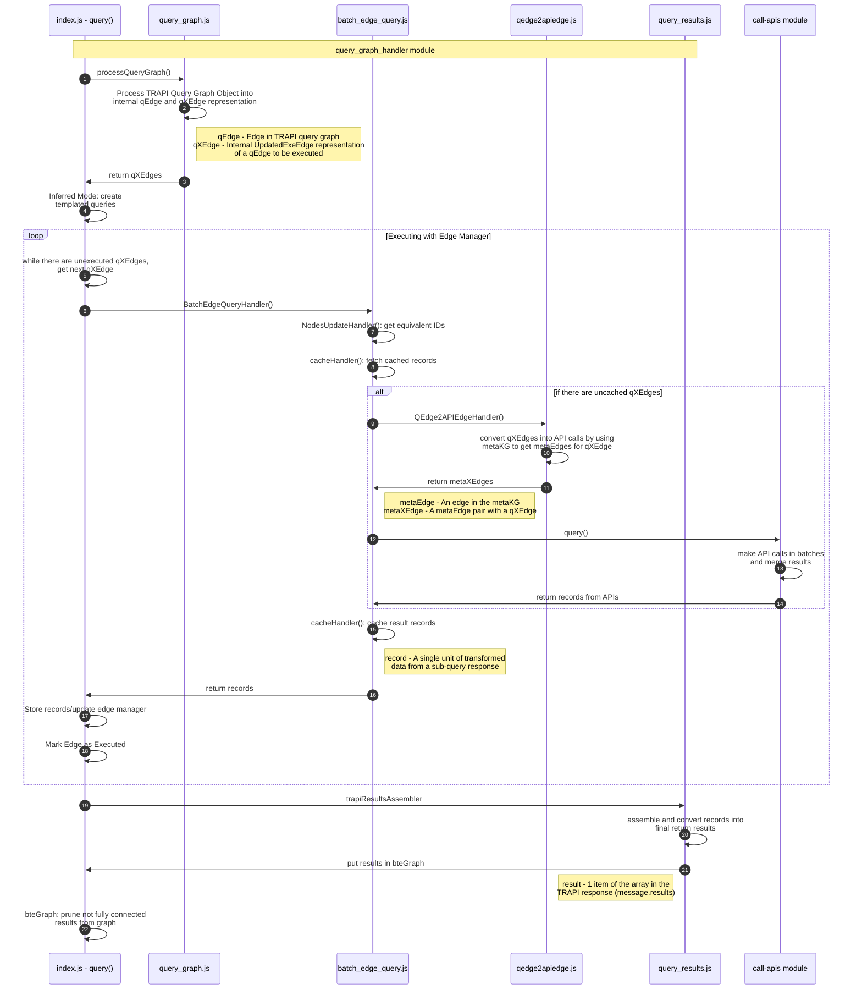

# BioThings Explorer TRAPI API

## Introduction

This GitHub repo serves as the development repo for the TRAPI API implementation of **BioThings Explorer (BTE)**. BTE is an engine for autonomously querying a distributed knowledge graph. The distributed knowledge graph is made up of biomedical APIs that have been annotated with semantically-precise descriptions of their inputs and outputs in the [SmartAPI registry](https://smart-api.info/). This project is primarily funded by the [NCATS Translator project](https://ncats.nih.gov/translator). There is also an older [python version of BioThings Explorer](https://github.com/biothings/biothings_explorer) that is currently not being actively developed.

An older version of the meta knowledge graph that is consumed by BTE is in this figure (which, although older, gives a nice conceptual visualization of API interoperability):

### What's TRAPI?

TRAPI stands for [Translator Reasoner API](https://github.com/NCATSTranslator/ReasonerAPI). It is a standard defined for APIs developed within NCATS Biomedical Translator project to facilitate information exchange between resources. BTE exports results via TRAPI to maintain interoperability with other Translator tools. BTE can also _consume_ knowledge resources that expose the TRAPI interface, but it also can consume APIs that have been annotated in the [SmartAPI registry](https://smart-api.info/) using the [x-bte extension](https://x-bte-extension.readthedocs.io/en/latest/index.html) to the OpenAPI specification.

### Trapi API Implementation

## Try it Out!

### Live TRAPI Instance

We maintain a live instance of this application at https://api.bte.ncats.io/ that can be used for testing. Query Examples can be found [here](/examples).

### Local installations

See [Installation documentation](./docs/INSTALLATION.md).

### Usage

See [Usage documentation](./docs/USAGE.md).
