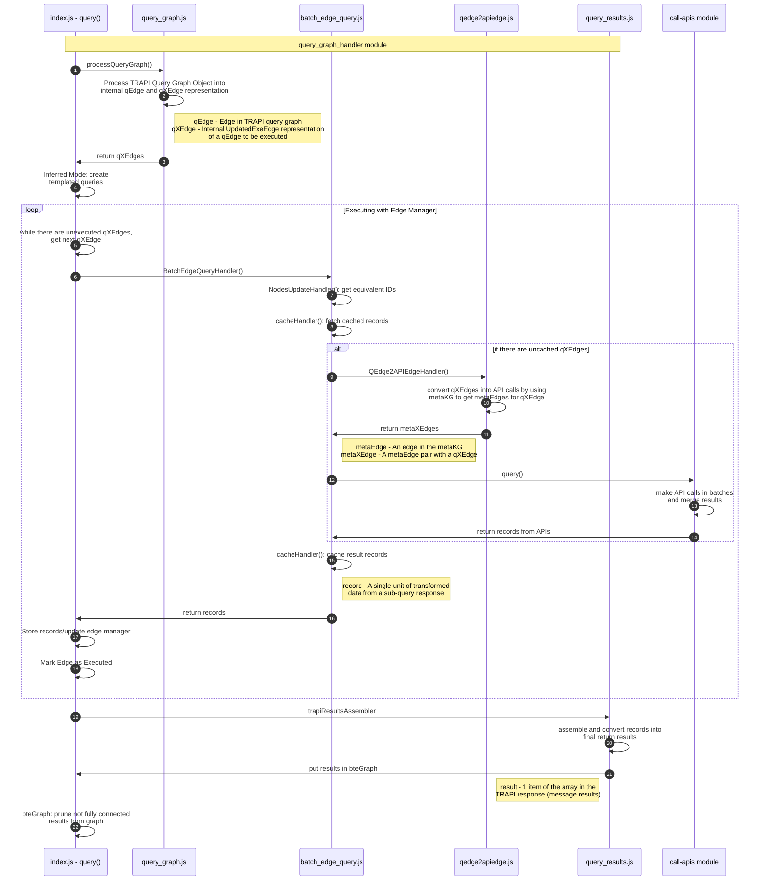

# BioThings Explorer TRAPI API
[](https://github.com/biothings/BioThings_Explorer_TRAPI/actions/workflows/test_ws_codecov.yml)
[](https://codecov.io/gh/biothings/BioThings_Explorer_TRAPI)
[](https://github.com/biothings/BioThings_Explorer_TRAPI/actions/workflows/deploy.yml)

## Introduction

This GitHub repo serves as the development repo for the TRAPI API implementation of **BioThings Explorer (BTE)**. BTE is an engine for autonomously querying a distributed knowledge graph. The distributed knowledge graph is made up of biomedical APIs that have been annotated with semantically-precise descriptions of their inputs and outputs in the [SmartAPI registry](https://smart-api.info/). This project is primarily funded by the [NCATS Translator project](https://ncats.nih.gov/translator).  There is also an older [python version of BioThings Explorer](https://github.com/biothings/biothings_explorer) that is currently not being actively developed.

An older version of the meta knowledge graph that is consumed by BTE is in this figure (which, although older, gives a nice conceptual visualization of API interoperability):


### What's TRAPI?

TRAPI stands for [Translator Reasoner API](https://github.com/NCATSTranslator/ReasonerAPI). It is a standard defined for APIs developed within NCATS Biomedical Translator project to facilitate information exchange between resources.  BTE exports results via TRAPI to maintain interoperability with other Translator tools.  BTE can also _consume_ knowledge resources that expose the TRAPI interface, but it also can consume APIs that have been annotated in the [SmartAPI registry](https://smart-api.info/) using the [x-bte extension](https://x-bte-extension.readthedocs.io/en/latest/index.html) to the OpenAPI specification.

### Live TRAPI Instance

We maintain a live instance of this application at https://api.bte.ncats.io/ that can be used for testing.  Query Examples can be found [here](/examples).

### Trapi API Implementation



---


## Local installations


*Note: these instructions have been updated to reflect usage in the [workspace](https://github.com/biothings/bte-trapi-workspace), which is required.*

### Requirements

For development, you will need Node.js and a node global package, e.g. npm, installed in your environment. Your Node version must be higher than v12.


- #### Node installation on Windows

  Just go on [official Node.js website](https://nodejs.org/) and download the installer.
Also, be sure to have `git` available in your PATH, `npm` might need it (You can find git [here](https://git-scm.com/)).

- #### Node installation on Ubuntu

  You can install nodejs and npm easily with apt install, just run the following commands.

      $ sudo apt install nodejs
      $ sudo apt install npm

- #### Other Operating Systems

  You can find more information about the installation on the [official Node.js website](https://nodejs.org/) and the [official NPM website](https://npmjs.org/).
  
 
Note that BTE uses the npm workspace feature, which requires npm 7+. It's recommended to use node v15+, which comes with npm v7.
You may consider using [nvm](https://github.com/nvm-sh/nvm#installing-and-updating) to install a newer version of node.

If the installation was successful, you should be able to run the following command.

    $ node --version
    v12.*.*

    $ npm --version
    7.24.2

If you need to update `npm`, you can make it using `npm`! Cool right? After running the following command, just open again the command line and be happy.

`$ npm install npm -g`

Additionally, some packages used by BTE require some additional packages:

Ubuntu:

    sudo apt install lz4 python3 make g++
    
MacOS will require the XCode Command Line Tools and [Homebrew](https://brew.sh/):

    xcode-select --install
    /bin/bash -c "$(curl -fsSL https://raw.githubusercontent.com/Homebrew/install/HEAD/install.sh)"
    

After installing brew, you can install the remaining dependencies:

    brew install lz4 python3 make

---

### Installation

    $ git clone https://github.com/biothings/bte-trapi-workspace.git
    $ cd bte-trapi-workspace
    $ npm run clone
    $ npm install || true && npm install
    
Note that installation must be run twice to ensure workspace interdependecies are installed properly. The last line simply ensures this is done without reporting ignorable failures.


### Running the project

To start the server with debug logging, which outputs logging statements to the terminal in real time:

```
npm start
```

To run the server without debug logging:

```
npm start --workspace='@biothings-explorer/bte-trapi'
```

By default, the `/v1/query` endpoint allows 15 queries per min, you could modify this behavior by setting MAX_QUERIES_PER_MIN environment variable when starting the service.

```
$ MAX_QUERIES_PER_MIN=5 npm start`
```

### Running the project with redis

If you have a native installation of redis, or a Docker image of the latest redis (`docker pull redis:latest`), the workspace provides a means of automatically starting the server alongside redis with default host/port configurations:

```
npm start redis
```

This will automatically start redis (preferring a Docker container, and falling back to native installation), and then start the server ready to connect to redis.

### Stopping the server

Should the server need to be stopped in the middle of an asynchronous request, or is otherwise misbehaving:

```
npm stop
```

This will ensure the server and its subprocesses are killed.

### Simple build for production

    $ npm build

### Deploy

A Dockerfile is included in the base directory of the [workspace](https://github.com/biothings/bte-trapi-workspace) and may be used to build and run the server in a container that simulates the production environment.

To build:

```bash
docker build --rm --force-rm --compress --squash -t biothings/bte-trapi .
```

*note: --squash requires experimental features to be enabled, however it may be omitted*

To run:

```bash
docker run -it --rm -p 3000:3000 --name bte-trapi biothings/bte-trapi
```

Run with debug logs enabled:

```bash
docker run -it --rm -p 3000:3000 --name bte-trapi -e DEBUG="biomedical-id-resolver,bte*" biothings/bte-trapi
```

The container may also be run with a redis-server running at a given host, which enables caching and use of the async endpoints:

```bash
docker run -it --rm -p 3000:3000 --name bte-t∞rapi  -e REDIS_HOST=host.docker.internal -e REDIS_PORT=6379 -e DEBUG="biomedical-id-resolver,bte*" biothings/
```

Log into the container:
```bash
docker exec -ti bte-trapi sh
```

The container can be built and started using docker-compose

```bash
docker-compose up
```

Public Docker image located at [here](https://hub.docker.com/repository/docker/biothings/bte_reasoner_api)

### Usage

You now can POST queries to `http://<HOST>:3000/v1/query`.

Query Examples can be found [here](/examples).

### Syncing SmartAPI Specifications

By default, this package does not automatically sync the latest SmartAPI Specifications. You may set it to do so by setting either `NODE_ENV=production` or `SMARTAPI_SYNC=true` as environment variables (e.g. `SMARTAPI_SYNC=true npm start`). `SMARTAPI_SYNC` overrides the behavior of `NODE_ENV`.

You may additionally manually trigger a one-time sync by using `npm run smartapi_sync` prior to running the project.

### Testing with Alternate SmartAPI Specs (local or hosted)

#### Using `API_OVERRIDE=true`

You may configure a set of API IDs to override from local files or URLs.

If the environment variable `API_OVERRIDE=true` is set (e.g. `SMARTAPI_SYNC=true API_OVERRIDE=true npm run debug --workspace=@biothings-explorer/bte-trapi`), then `/config/smartapi_overrides.json` is checked at server start and overrides are applied, as well as during subsequent `smartapi_specs.json` updates. Note that syncing must be enabled (`SMARTAPI_SYNC=true`) in order for `API_OVERRIDE` to take effect.

Alternatively, you may choose to only get `smartapi_specs.json` and apply overrides once by running `API_OVERRIDE=true npm run smartapi_sync --workspace='@biothings-explorer/bte-trapi'`, removing the requirement of enabling `SMARTAPI_SYNC` while running the server.

Override files may be specified as a URL which returns the expected yaml file or a `file:///` URI or arbitrary filepath, either of which must contain the absolute path to your override file. Regardless, override files are expected to be in yaml format. If overrides are specified with IDs not in the current SmartAPI spec, they will be appended as new API hits with a log warning.

You may also set `only_overrides` to `true` in the config to remove all other APIs and keep only the specified overrides.

Example:

Replace the latest MyGene.info API with a specific revision, and the MyChem.info API with a local test version:

```JSON
{
  "conf": {
    "only_overrides": false
  },
  "apis": {
    "59dce17363dce279d389100834e43648": "https://raw.githubusercontent.com/NCATS-Tangerine/translator-api-registry/8b36f46d59c82d19b5cba40421a6ca9c2ed62e6b/mygene.info/openapi_full.yml",
    "8f08d1446e0bb9c2b323713ce83e2bd3": "file:///absolute/path/to/file/mychem_test.yaml"
  }
}
```

#### Using `API_OVERRIDE=true` with Docker container

You may wish to use a container to test your custom API/annotations. After making changes to your override list (example above) you will need to rebuild the container:

```bash
docker build --rm --force-rm --compress --squash -t biothings/bte-trapi .
```

*note: --squash requires experimental features to be enabled, however it may be omitted*

To run the container with overrides and debug logging enabled:

```bash
docker run -it --rm -p 3000:3000 --name bte-trapi -e DEBUG="biomedical-id-resolver,bte*" -e API_OVERRIDE=true biothings/bte-trapi
```

### Testing on a specific SmartAPI API

By default, BTE queries all APIs specified in the the[ config.js file](https://github.com/biothings/BioThings_Explorer_TRAPI/blob/main/src/routes/v1/config.js).  In some cases, you may want to override that default to specifically query a single API.  For example, the SmartAPI record for the "EBI Proteins API) is [43af91b3d7cae43591083bff9d75c6dd](https://smart-api.info/registry?q=43af91b3d7cae43591083bff9d75c6dd). To instruct BTE to query that API only, you can POST your query to http://localhost:3000/v1/smartapi/43af91b3d7cae43591083bff9d75c6dd/query

### Asynchronous queries

You can also use our asynchronous query with both web callback and polling support.

To sumbit an async query:

POST on `http://localhost:3000/asyncquery`. This endpoint behaves similarly to the `http://localhost:3000/query` endpoint with the same query graph as the input.

```
POST  {{base_url}}/v1/asyncquery
Content-Type: application/json

{
    "message": {
        "query_graph": {
            "edges": {
                "e0": {
                    "subject": "n0",
                    "object": "n1",
                    "predicates": [
                        "biolink:decreases_abundance_of",
                        "biolink:decreases_activity_of",
                        "biolink:decreases_expression_of"
                    ]
                }
            },
            "nodes": {
                "n0": {
                    "categories": ["biolink:SmallMolecule"],
                    "name": "some chemical"
                },
                "n1": {
                    "name": "EGFR",
                    "ids": ["NCBIGene:1956"]
                }
            }
        }
    }
}

```


**Key differences in an async query**
- Instead of waiting for the query to complete a job *id* is returned which you can then use to check the query status.
- If an additional *callback* parameter is provided, we will send the query result to this callback URL via POST (optional).

The returned response looks like this:

```
{
  "id": "N96xbq25zP",
  "url": "http://localhost:3000/v1/check_query_status/N96xbq25zP"
}
```

**You can then retrieve query results in two ways:**

  1. **Checking the query status**

     You can perform a GET request to the `http://localhost:3000/check_async_query/<id>` to check the query status. When the query is finished, the example response will look like this (query result is returned in `returnvalue` field):

     ```
     {
       'id': 'N96xbq25zP',
       'state': 'completed',
       'returnvalue': {
         'response': { ... },
         'status': 200
       },
       'progress': 0
     }
     ```

   2. **Return result via a callback URL**

      When a callback URL is provided in the input sent to `/v1/asyncquery`, like this:

      ```
      {
        "callback": "https://example.com/handle_query_result",
        "message": {
            "query_graph": {
                   ...
                }
            }
        }
      }
      ```

      Once the query is executed, its query result will be sent to this callback URL via POST. The status can also be checked via `/check_async_query/<id>` endpoint:

      ```
      {
        'id': 'N96xbq25zP',
        'state': 'completed',
        'returnvalue': {
          'response': { ... },
          'status': 200
          'callback': 'Data sent to callback_url'
        },
        'progress': 0
      }
      ```

### Environment Variables

Several environment variables are supported for various purposes, listed below:

- `NODE_ENV` When set as `NODE_ENV=production`, the package runs in production mode, including synchronizing the latest SmartAPI specifications on a schedule.
- `PORT` Sets the port the server will listen on. Defaults to `3000`.
- `SMARTAPI_SYNC=true|false` May be set to override all SmartAPI syncing behavior.
- `API_OVERRIDE=true|false` May be set to set overrides for specific APIs (see [Using `API_OVERRIDE=true`](#using-api_overridetrue))
- `RESULT_CACHING=true|false` May be set to enable or disable the use of caching for query result edges. Requires `REDIS_HOST` and `REDIS_PORT` to be enabled.
- `REDIS_HOST` The hostname of the Redis server to be used for caching.
- `REDIS_PORT` The port of the Redis server to be used for caching.
- `REDIS_PASSWORD` The password for the Redis server, if applicable.
- `REDIS_TLS_ENABLED` Enables TLS mode for the Redis client.
- `REDIS_KEY_EXPIRE_TIME` Sets the time to keep cached results in seconds. Defaults to 10 minutes.
- `JOB_TIMEOUT` Sets a timeout on asynchronous jobs in ms. No default.
- `ASYNC_COMPLETED_EXPIRE_TIME` Sets the amount of time to keep an asynchronous job result, after which the results expire and are deleted to make space for new job results. Expressed in seconds. Defaults to 7 days.
- `DEBUG` May be set to capture different package debug logs by match to comma-separated strings.
- `SETIMMEDIATE_TIME` Override the timing used on several calls to `setImmediatePromise()` used for performance reasons. Shouldn't be overridden except for performance testing purposes. Expressed in ms.
- `MAX_QUERIES_PER_MIN` Sets the maximum number of queries allowable from a client in a 1-minute window. Defaults to 15.
- `STATIC_PATH` Overrides the path to the folder containing `./data/smartapi_specs.json` and `./data/predicates.json`.
- `REQUEST_TIMEOUT` Sets a timeout for non-synchronous threaded requests in seconds. No default, however the monorepo pm2 configuration defaults to 20 minutes.
- `USE_THREADING` Disables threading (threaded requests fall back to non-threaded execution) when set to `false`. Threading is enabled by default.
- `BIOLINK_FILE` Overrides path to biolink file.
